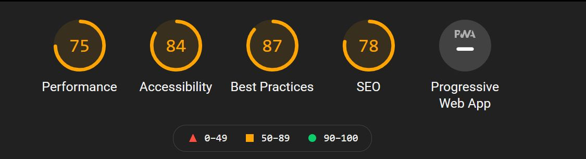
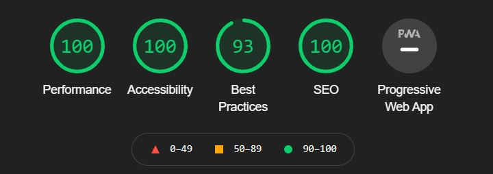

# Optimisez un site web existant

Projet 4 OpenClassrooms   formation pour le titre de développeur web

## Consignes 
- ### Analyse de l’état actuel de SEO du site fourni.
>J’aimerais que tu indiques les parties du
site qui ne sont pas optimisées pour le SEO et/ou qui ne sont pas à jour en termes
d’accessibilité, et que tu justifies tes choix. Pense à ajouter la bonne pratique à mettre
en place pour chaque partie du site qui n’est pas optimisée, en citant tes sources. Une fois ce modèle complété, j’aimerais que tu sélectionnes 10 recommandations pour améliorer le site. Je te laisse cocher ces 10 recommandations choisies dans la colonne “Action recommandée”.
Il faudra bien garder en tête que le but est que notre site soit mieux classé lorsqu’on
tape “Entreprise webdesign Lyon” dans les moteurs de recherche. Martin voudrait qu’il y
en ait au moins une sur la vitesse et la taille du site et une sur l’accessibilité.
Actuellement, certains de nos utilisateurs rencontrent des problèmes d’accessibilité sur
notre site, c’est un point sur lequel on veut s’améliorer. Tu devras donc ajouter les
éléments nécessaires. La liste de ce que tu devras implémenter se trouve à cette
adresse.
- ### Amélioration du SEO du site. 
>Il faudra ensuite optimiser notre site en appliquant tes 10
recommandations à son contenu et à son code source. Tu devras pour cela fournir le
code source complet de la version améliorée du site. Le site doit passer le W3C pour
HTML et CSS.
- ### Comparaison des résultats. 
>La vitesse de chargement des pages du site a un impact
sur notre classement dans les résultats de recherche. Dans tes différentes
recommandations, j’aimerais que tu prennes des mesures pour accélérer la vitesse de
chargement, et que tu me démontres que cela fonctionne, grâce à des captures d’écran
comparatives entre la version du site actuelle et celle que tu auras optimisée, fourni
dans un rapport d’optimisation. Ce rapport devra inclure les comparaisons pour les 10
recommandations.

## Outils 👨‍💻

Checklist SEO, HeadingMap, TPG Colour Contrast Analyser, NVDA, Lighthouse, W3C Validator, Wave Evaluation tool , aXe, ...

## Rapport SEO

> Le compte-rendu se trouve dans le dossier "rapport_seo" ( `'A executer dans un environnement PHP'` ).

# `Avant`

# `Après`
 

# 

### Auteurs
> **Georges Ramos** _alias_ [@Jokdeve-Looper](https://github.com/Jokdeve-0)